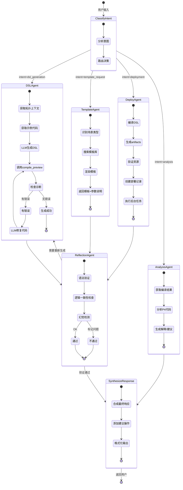
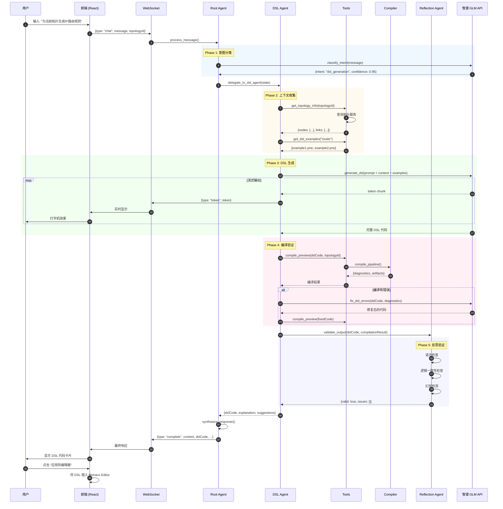
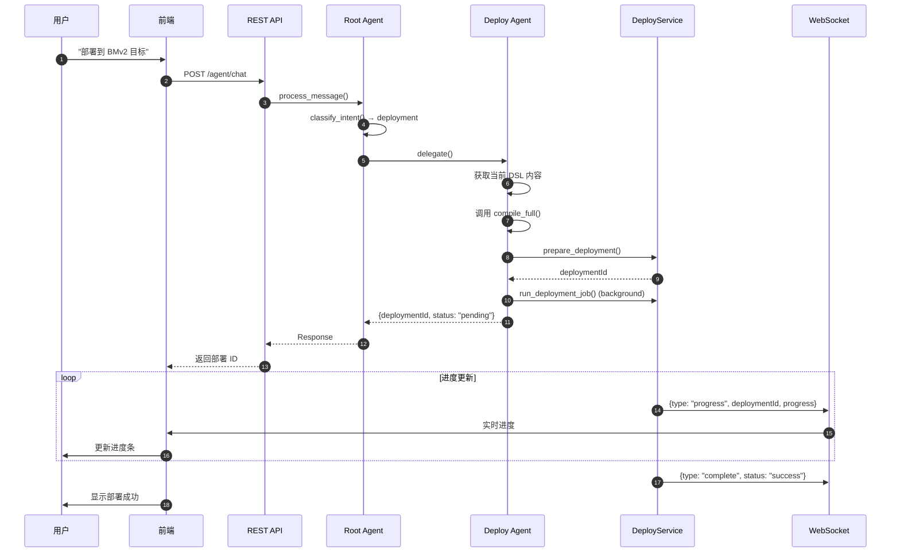
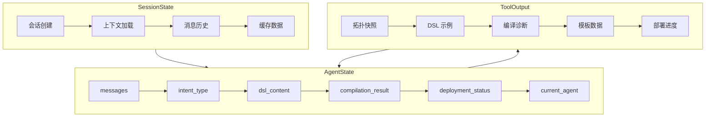
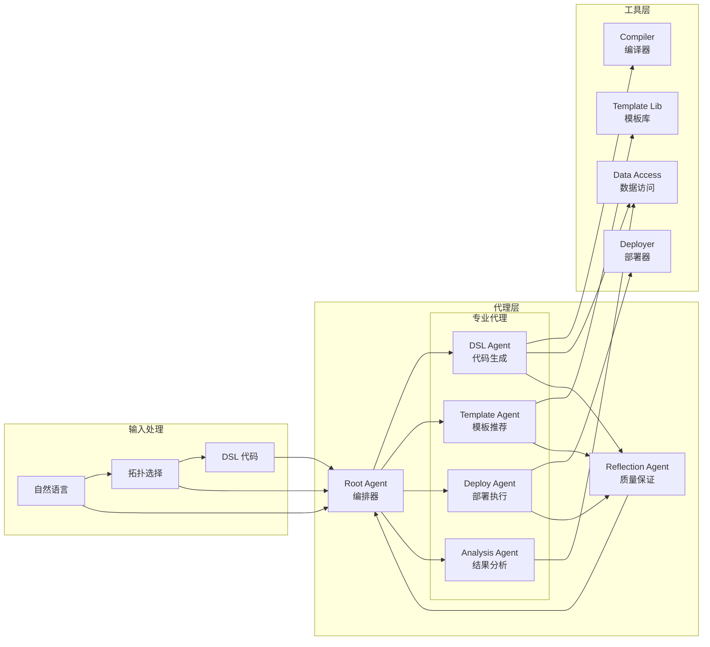

# 生成式可编程网络智能体 - 架构设计

> 设计日期: 2026-03-23
> 技术栈: LangChain + LangGraph + 智谱 GLM API

## 概述

设计一个基于 LangChain + 智谱 GLM API 的生成式网络智能体，能够：
- 根据自然语言描述生成 PNE DSL 代码
- 根据业务场景推荐/生成协议模板
- 自动规划并执行部署流程

该智能体将嵌入现有 ParaNet React 前端，复用现有编译器和部署系统，支持 BMv2/Tofino 多环境部署。

---

## 1. 智能体工作流

### 1.1 主工作流 (LangGraph 状态图)



### 1.2 详细时序图 - DSL 生成流程



### 1.3 部署流程时序图



### 1.4 状态流转图



### 1.5 代理协作矩阵



---

## 2. 整体架构

```
┌─────────────────────────────────────────────────────────────────┐
│                     Frontend (React)                            │
│  ┌─────────────┐  ┌─────────────┐  ┌─────────────────────────┐ │
│  │ AgentChat   │  │   Monaco    │  │   D3 Topology           │ │
│  │ Panel       │◄─┤   Editor    │  │   Visualizer            │ │
│  └──────┬──────┘  └─────────────┘  └─────────────────────────┘ │
└─────────┼───────────────────────────────────────────────────────┘
          │ WebSocket / REST
          ▼
┌─────────────────────────────────────────────────────────────────┐
│                    Backend (FastAPI)                            │
│  ┌─────────────────────────────────────────────────────────────┐│
│  │                    Agent Service                             ││
│  │  ┌─────────────────────────────────────────────────────────┐││
│  │  │              LangGraph Workflow                          │││
│  │  │  ┌───────┐   ┌───────┐   ┌───────┐   ┌───────┐        │││
│  │  │  │ Root  │──►│ DSL/  │──►│Reflect│──►│Synth- │        │││
│  │  │  │ Agent │   │Deploy │   │ Agent │   │esize  │        │││
│  │  │  └───────┘   └───────┘   └───────┘   └───────┘        │││
│  │  └─────────────────────────────────────────────────────────┘││
│  └─────────────────────────────────────────────────────────────┘│
│          │                    │                    │            │
│          ▼                    ▼                    ▼            │
│  ┌─────────────┐      ┌─────────────┐      ┌─────────────┐     │
│  │  Compiler   │      │  Deploy     │      │  Template   │     │
│  │  Pipeline   │      │  Service    │      │  Library    │     │
│  └─────────────┘      └─────────────┘      └─────────────┘     │
└─────────────────────────────────────────────────────────────────┘
          │
          ▼
┌─────────────────────────────────────────────────────────────────┐
│                   LLM Backend (智谱 GLM)                        │
└─────────────────────────────────────────────────────────────────┘
```

---

## 3. 目录结构

```
paranet/agent/                      # 新增智能体模块
├── __init__.py
├── agents/
│   ├── __init__.py
│   ├── root_agent.py               # 根代理编排器
│   ├── dsl_agent.py                # DSL 生成代理
│   ├── template_agent.py           # 模板代理
│   ├── deploy_agent.py             # 部署代理
│   ├── analysis_agent.py           # 分析代理
│   └── reflection_agent.py         # 反思验证代理
├── tools/
│   ├── __init__.py
│   ├── compiler_tools.py           # 编译器工具
│   ├── deploy_tools.py             # 部署工具
│   ├── data_tools.py               # 数据访问工具
│   ├── template_tools.py           # 模板工具
│   └── langchain_tools.py          # LangChain 工具适配
├── llm/
│   ├── __init__.py
│   ├── zhipu.py                    # 智谱 GLM 集成
│   └── providers.py                # LLM 提供者工厂
├── graph/
│   ├── __init__.py
│   ├── workflow.py                 # LangGraph 状态图
│   ├── nodes.py                    # 图节点函数
│   └── routing.py                  # 条件路由
├── state/
│   ├── __init__.py
│   ├── schema.py                   # 状态模型
│   └── manager.py                  # 会话管理
├── templates/
│   ├── protocols/                  # 协议模板
│   ├── applications/               # 应用模板
│   ├── scenarios/                  # 场景模板
│   └── registry.yaml               # 模板索引
└── prompts/
    ├── __init__.py
    ├── system_prompts.py           # 系统提示词
    └── few_shot.py                 # Few-shot 示例

backend/app/
├── api/v1/
│   └── agent.py                    # Agent REST API
└── services/
    └── agent_service.py            # Agent 服务层

frontend/src/
├── components/agent/
│   ├── AgentChatPanel/             # 聊天面板
│   ├── AgentStatusIndicator/       # 状态指示
│   └── DSLSuggestionCard/          # DSL 建议卡片
├── stores/
│   └── agent.ts                    # Agent Zustand Store
└── api/
    └── agent.ts                    # Agent API 客户端
```

---

## 4. 核心组件实现

### 4.1 智谱 GLM 集成

```python
# paranet/agent/llm/zhipu.py
from langchain_community.chat_models import ChatZhipuAI
import os

class ZhipuGLMConfig:
    """智谱 GLM API 配置"""

    def __init__(self):
        self.api_key = os.environ.get("ZHIPU_API_KEY")
        self.base_url = os.environ.get(
            "ZHIPU_BASE_URL",
            "https://open.bigmodel.cn/api/paas/v4"
        )

    def get_chat_model(self, model_name: str = "glm-4") -> ChatZhipuAI:
        return ChatZhipuAI(
            model=model_name,
            zhipuai_api_key=self.api_key,
            streaming=True,
            temperature=0.1,  # 低温度确保代码生成稳定性
        )

    def get_fast_model(self) -> ChatZhipuAI:
        """获取快速模型 (用于意图分类等)"""
        return self.get_chat_model("glm-4-flash")
```

### 4.2 LangGraph 工作流

```python
# paranet/agent/graph/workflow.py
from langgraph.graph import StateGraph, END
from typing import TypedDict, Annotated
import operator

class AgentState(TypedDict):
    """智能体状态定义"""
    messages: Annotated[list, operator.add]
    session_id: str
    intent_type: str          # dsl_generation | template | deployment | analysis
    dsl_content: str
    compilation_result: dict
    deployment_status: dict
    current_agent: str
    errors: list

def build_agent_graph():
    """构建多代理工作流图"""

    workflow = StateGraph(AgentState)

    # 添加节点
    workflow.add_node("classify_intent", classify_intent_node)
    workflow.add_node("dsl_agent", dsl_agent_node)
    workflow.add_node("template_agent", template_agent_node)
    workflow.add_node("deploy_agent", deploy_agent_node)
    workflow.add_node("analysis_agent", analysis_agent_node)
    workflow.add_node("reflection", reflection_node)
    workflow.add_node("synthesize", synthesize_response_node)

    # 设置入口点
    workflow.set_entry_point("classify_intent")

    # 条件路由
    workflow.add_conditional_edges(
        "classify_intent",
        route_by_intent,
        {
            "dsl": "dsl_agent",
            "template": "template_agent",
            "deploy": "deploy_agent",
            "analyze": "analysis_agent",
        }
    )

    # DSL 生成流程
    workflow.add_edge("dsl_agent", "reflection")
    workflow.add_edge("template_agent", "reflection")
    workflow.add_edge("deploy_agent", "reflection")

    # 验证流程
    workflow.add_conditional_edges(
        "reflection",
        route_by_validation,
        {
            "pass": "synthesize",
            "retry_dsl": "dsl_agent",
            "retry_template": "template_agent",
        }
    )

    # 分析流程 (不需要验证)
    workflow.add_edge("analysis_agent", "synthesize")

    # 结束
    workflow.add_edge("synthesize", END)

    return workflow.compile()
```

### 4.3 核心工具定义

```python
# paranet/agent/tools/compiler_tools.py
from langchain_core.tools import tool
from typing import Optional, Dict, Any
from compiler.pipeline import compile_pipeline, CompilePipelineResult

@tool
def compile_preview(
    dsl_content: str,
    topology_id: Optional[str] = None,
) -> Dict[str, Any]:
    """
    编译 PNE DSL 并返回诊断信息，不持久化结果。

    Args:
        dsl_content: PNE DSL 源代码
        topology_id: 可选的拓扑 ID，用于上下文感知编译

    Returns:
        包含 success, diagnostics, artifacts_preview 的字典
    """
    topology_snapshot = _get_topology_snapshot(topology_id) if topology_id else None

    result: CompilePipelineResult = compile_pipeline(
        dsl_content,
        topology_snapshot=topology_snapshot,
        output_dir=None,
        default_target="bmv2",
    )

    return {
        "success": result.program is not None,
        "diagnostics": [d.to_dict() for d in result.diagnostics],
        "artifacts_preview": result.artifacts,
        "program_ir": result.program.to_dict() if result.program else None,
    }

@tool
def get_dsl_examples(
    category: str = "router",
    limit: int = 3,
) -> list[str]:
    """
    获取 DSL 示例代码供参考。

    Args:
        category: 示例类别 (router, switch, gateway, acl, forwarding)
        limit: 返回的最大示例数量
    """
    # 从 dsl/examples/ 目录加载示例
    examples_dir = Path(__file__).parent.parent.parent / "dsl" / "examples"
    # ... 实现加载逻辑
    pass

@tool
def get_topology_info(topology_id: str) -> Dict[str, Any]:
    """
    获取拓扑信息。

    Args:
        topology_id: 拓扑 ID

    Returns:
        包含 nodes, links 的拓扑快照
    """
    # 调用现有的拓扑服务
    pass
```

### 4.4 前端聊天组件

```tsx
// frontend/src/components/agent/AgentChatPanel/index.tsx
import React, { useState, useCallback } from 'react'
import { Spin, Button, Tooltip } from 'antd'
import { CodeOutlined, RocketOutlined } from '@ant-design/icons'
import ChatMessageList from './ChatMessageList'
import ChatInput from './ChatInput'
import { useAgentStore } from '@/stores/agent'
import { agentApi } from '@/api/agent'
import styles from './index.module.less'

export interface AgentMessage {
  id: string
  role: 'user' | 'assistant' | 'system'
  content: string
  dslCode?: string
  explanation?: string
  suggestions?: string[]
  agentType?: 'dsl' | 'template' | 'deploy' | 'analysis'
  status?: 'pending' | 'streaming' | 'complete' | 'error'
}

interface AgentChatPanelProps {
  topologyId?: string
  onApplyDSL?: (dsl: string) => void
  onDeploy?: (artifactId: string) => void
}

const AgentChatPanel: React.FC<AgentChatPanelProps> = ({
  topologyId,
  onApplyDSL,
  onDeploy,
}) => {
  const { messages, addMessage, updateMessage, isLoading, setLoading } = useAgentStore()
  const [streamingId, setStreamingId] = useState<string | null>(null)

  const handleSend = useCallback(async (text: string) => {
    const userMsg: AgentMessage = {
      id: `user-${Date.now()}`,
      role: 'user',
      content: text,
      status: 'complete',
    }
    addMessage(userMsg)
    setLoading(true)

    try {
      const ws = agentApi.createChatWebSocket()

      ws.onmessage = (event) => {
        const data = JSON.parse(event.data)

        if (data.type === 'token') {
          // 流式 token
          updateMessage(streamingId, (msg) => ({
            ...msg,
            content: msg.content + data.token,
            status: 'streaming',
          }))
        } else if (data.type === 'complete') {
          // 完成响应
          const assistantMsg: AgentMessage = {
            id: `assistant-${Date.now()}`,
            role: 'assistant',
            content: data.content,
            dslCode: data.dslCode,
            explanation: data.explanation,
            suggestions: data.suggestions,
            agentType: data.agentType,
            status: 'complete',
          }
          addMessage(assistantMsg)
          setStreamingId(null)
        } else if (data.type === 'error') {
          // 错误处理
          addMessage({
            id: `error-${Date.now()}`,
            role: 'system',
            content: `错误: ${data.message}`,
            status: 'error',
          })
        }
      }

      ws.send(JSON.stringify({
        type: 'chat',
        message: text,
        topologyId,
      }))

    } catch (error) {
      addMessage({
        id: `error-${Date.now()}`,
        role: 'system',
        content: `连接失败: ${error}`,
        status: 'error',
      })
    } finally {
      setLoading(false)
    }
  }, [topologyId, addMessage, updateMessage, setLoading])

  return (
    <div className={styles.chatPanel}>
      <div className={styles.header}>
        <span className={styles.title}>Network Agent</span>
        <AgentStatusIndicator />
      </div>

      <ChatMessageList
        messages={messages}
        onApplyDSL={onApplyDSL}
        onDeploy={onDeploy}
      />

      <ChatInput
        onSend={handleSend}
        disabled={isLoading}
        placeholder="描述你的网络意图..."
        suggestions={[
          "为当前拓扑生成 IP 转发规则",
          "创建一个支持 NAT 的路由器",
          "部署到 BMv2 目标",
          "解释当前的 P4 代码",
        ]}
      />
    </div>
  )
}

export default AgentChatPanel
```

### 4.5 Zustand Store

```typescript
// frontend/src/stores/agent.ts
import { create } from 'zustand'
import { persist } from 'zustand/middleware'

export interface AgentMessage {
  id: string
  role: 'user' | 'assistant' | 'system'
  content: string
  dslCode?: string
  explanation?: string
  suggestions?: string[]
  agentType?: 'dsl' | 'template' | 'deploy' | 'analysis'
  status?: 'pending' | 'streaming' | 'complete' | 'error'
}

export interface AgentState {
  sessionId: string | null
  messages: AgentMessage[]
  isLoading: boolean
  currentAgent: string | null
  context: {
    topologyId: string | null
    projectId: string | null
    currentDSL: string
  }

  // Actions
  setSessionId: (id: string) => void
  addMessage: (msg: AgentMessage) => void
  updateMessage: (id: string, updater: (msg: AgentMessage) => AgentMessage) => void
  setLoading: (loading: boolean) => void
  setCurrentAgent: (agent: string | null) => void
  setContext: (ctx: Partial<AgentState['context']>) => void
  clearMessages: () => void
}

export const useAgentStore = create<AgentState>()(
  persist(
    (set, get) => ({
      sessionId: null,
      messages: [],
      isLoading: false,
      currentAgent: null,
      context: {
        topologyId: null,
        projectId: null,
        currentDSL: '',
      },

      setSessionId: (id) => set({ sessionId: id }),

      addMessage: (msg) => set((state) => ({
        messages: [...state.messages, msg],
      })),

      updateMessage: (id, updater) => set((state) => ({
        messages: state.messages.map((msg) =>
          msg.id === id ? updater(msg) : msg
        ),
      })),

      setLoading: (loading) => set({ isLoading: loading }),

      setCurrentAgent: (agent) => set({ currentAgent: agent }),

      setContext: (ctx) => set((state) => ({
        context: { ...state.context, ...ctx },
      })),

      clearMessages: () => set({ messages: [] }),
    }),
    {
      name: 'agent-session',
      partialize: (state) => ({
        sessionId: state.sessionId,
        messages: state.messages.slice(-50), // 保留最近 50 条消息
      }),
    }
  )
)
```

---

## 5. 代理角色说明

| 代理 | 模型 | 职责 | 工具 |
|------|------|------|------|
| **Root Agent** | GLM-4-Flash | 意图分类、路由分发、结果合成 | classify_intent, route_to_specialist |
| **DSL Agent** | GLM-4 | 自然语言 → PNE DSL 代码生成 | compile_preview, get_topology_info, get_dsl_examples |
| **Template Agent** | GLM-4-Flash | 业务场景 → 协议模板推荐 | search_templates, render_template |
| **Deploy Agent** | GLM-4-Flash | 部署编排 + 执行监控 | create_deployment, get_status, rollback |
| **Analysis Agent** | GLM-4-Flash | 结果分析 + 错误解释 | analyze_compilation, explain_p4_code |
| **Reflection Agent** | GLM-4-Flash | 输出验证 + 幻觉检测 | validate_syntax, check_consistency |

---

## 6. 实现步骤

### Phase 1: 基础设施 (第 1-2 周)
1. 创建 `paranet/agent/` 模块结构
2. 实现智谱 GLM API 集成 (`llm/zhipu.py`)
3. 实现会话状态管理 (`state/manager.py`)
4. 创建基础 LangChain 工具

### Phase 2: 核心代理 (第 3-4 周)
5. 实现 Root Agent 意图分类
6. 实现 DSL Generation Agent
7. 实现 Template Agent
8. 实现 Reflection Agent 输出验证

### Phase 3: 部署集成 (第 5 周)
9. 实现 Deployment Agent
10. 连接现有 `deploy_service`
11. 实现 WebSocket 进度推送

### Phase 4: 前端集成 (第 6 周)
12. 创建 `AgentChatPanel` 组件
13. 实现 `useAgentStore` Zustand store
14. WebSocket 流式 UI
15. DSL 建议卡片

### Phase 5: 完善测试 (第 7-8 周)
16. 实现 Analysis Agent
17. 智能缓存优化
18. 单元测试 + 集成测试
19. 性能优化
20. 文档编写

---

## 7. 环境配置

```bash
# .env
ZHIPU_API_KEY=your_zhipu_api_key
ZHIPU_BASE_URL=https://open.bigmodel.cn/api/paas/v4

# requirements.txt 新增
langchain>=0.2.0
langchain-community>=0.2.0
langgraph>=0.1.0
zhipuai>=2.0.0
```

---

## 8. 风险与缓解

| 风险 | 缓解措施 |
|------|---------|
| GLM API 响应延迟 | 流式输出 + 超时处理 |
| 生成的 DSL 语法错误 | Reflection Agent + compile_preview 验证 |
| 部署失败回滚 | 复用现有 Deployer 回滚机制 |
| 会话状态丢失 | SQLite 持久化 + Redis (生产) |
| Token 成本过高 | 智能缓存 + 分级模型 (GLM-4-Flash 分类, GLM-4 生成) |
